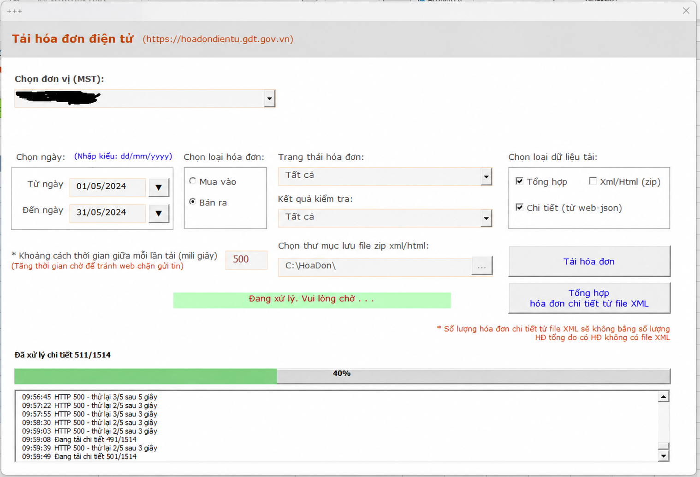

# Tải Hóa Đơn Điện Tử

File Excel VBA giúp tải, tra cứu và tổng hợp hóa đơn từ `hoadondientu.gdt.gov.vn`.

**Phiên bản mới nhất: v6.7.0**

[Tải TaiHoaDonDienTu_v6.7.0.xlsm](https://github.com/dieutx/TaiHoaDonDienTu/releases/latest/download/TaiHoaDonDienTu_v6.7.0.xlsm)



## Cài đặt

1. Tải file `.xlsm` từ liên kết phía trên.
2. Mở **Properties** của file và chọn **Unblock** nếu Windows hiển thị tùy chọn này.
3. Mở file bằng Microsoft Excel và cho phép chạy macro.
4. Đăng nhập bằng tài khoản trên hệ thống hóa đơn điện tử.

## Cách sử dụng

1. Chọn đơn vị và loại hóa đơn **Mua vào** hoặc **Bán ra**.
2. Chọn ngày bằng lịch hoặc nhập theo định dạng `dd/mm/yyyy`.
3. Chọn dữ liệu cần tải: tổng hợp, chi tiết hoặc XML/HTML.
4. Chọn trạng thái hóa đơn và kết quả kiểm tra nếu cần lọc.
5. Bấm **Tải hóa đơn** và theo dõi kỳ, nguồn API, trang, HTTP, số hóa đơn cùng thời gian phản hồi trong log.
6. Có thể bấm **Tạm dừng/Tiếp tục** hoặc **Dừng**; dữ liệu đã tải trước khi dừng vẫn được giữ lại.
7. Xem kết quả tại các sheet tổng hợp, chi tiết và `BaoCao_LoiTaiHD`.

## Tính năng chính

- Tải hóa đơn mua vào và bán ra.
- Hỗ trợ hóa đơn thông thường và hóa đơn từ máy tính tiền.
- Chọn ngày bằng date picker hoặc nhập trực tiếp.
- Hiển thị tiến độ và log chi tiết từng kỳ/trang `query` và `sco-query`.
- Tạm dừng, tiếp tục hoặc dừng an toàn sau request hiện tại.
- Retry khi gặp lỗi tạm thời hoặc HTTP 429/500.
- Tải dữ liệu tổng hợp, chi tiết và ZIP XML/HTML.
- Lấy chuỗi hóa đơn thay thế/điều chỉnh và thông tin sai sót liên quan.
- Báo cáo lỗi chỉ giữ những tác vụ chưa xử lý thành công.

## Yêu cầu

- Windows.
- Microsoft Excel có hỗ trợ VBA.
- Kết nối Internet và tài khoản hợp lệ tại `hoadondientu.gdt.gov.vn`.

## Lưu ý bảo mật

- Không chia sẻ file đã chứa token, cookie, mã số thuế hoặc dữ liệu hóa đơn thật.
- Nếu gặp lỗi 401/403, hãy đăng nhập lại để tạo phiên mới.
- Không đặt khoảng nghỉ giữa các request quá thấp vì hệ thống có thể trả HTTP 429.
- Xem [hướng dẫn xử lý sự cố](docs/TROUBLESHOOTING.md) khi cần.

## Dành cho developer

Source VBA nằm trong `src`, template workbook nằm trong `template` và script build nằm trong `build`.

```powershell
.\build\Build-Excel.ps1 -Version '6.7.0' -OutputPath '.\dist\TaiHoaDonDienTu_v6.7.0.xlsm'
.\tests\Test-RetryUiStatic.ps1
.\build\Test-Build.ps1 -BuiltWorkbook '.\dist\TaiHoaDonDienTu_v6.7.0.xlsm' -RunUserFormInstantiation
.\build\Test-RelatedInvoiceRuntime.ps1 -BuiltWorkbook '.\dist\TaiHoaDonDienTu_v6.7.0.xlsm'
```

Đọc [CONTRIBUTING.md](CONTRIBUTING.md) và [SECURITY.md](SECURITY.md) trước khi gửi thay đổi.

## Nguồn tham khảo

Dự án phát triển từ ý tưởng và công cụ Excel VBA do thành viên **ongke0711** chia sẻ tại diễn đàn Giải Pháp Excel:

[Tải hóa đơn điện tử – Giải Pháp Excel](https://www.giaiphapexcel.com/diendan/threads/t%E1%BA%A3i-h%C3%B3a-%C4%91%C6%A1n-%C4%91i%E1%BB%87n-t%E1%BB%AD-https-hoadondientu-gdt-gov-vn-excel-vba.171723/)

Đây là dự án cộng đồng, không phải sản phẩm chính thức của cơ quan thuế. Repository hiện chưa công bố giấy phép phần mềm; xem thêm [NOTICE.md](NOTICE.md).
