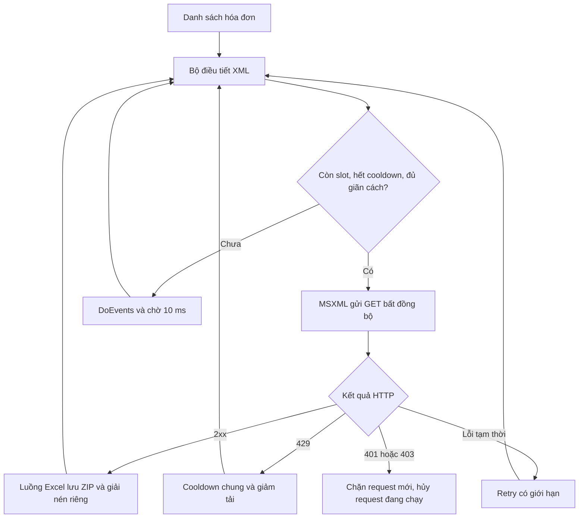

# Logic tải XML song song

Áp dụng chính sách của [XmlScheduler.ps1](https://github.com/dieutx/hddt-downloader-windows/blob/b717ab9/src/XmlScheduler.ps1) trong bản clone `C:\Users\dieut\hddt-downloader-windows` (commit `b717ab9`). VBA dùng HTTP bất đồng bộ của MSXML thay cho runspace PowerShell. Danh sách và phân trang vẫn xử lý tuần tự. Chi tiết và thông tin liên quan dùng [bộ tải JSON song song](JSON_PARALLEL_DOWNLOAD.md) riêng; không chạy đồng thời với pha XML.



Mặc định trong `src/modules/modGdtXmlScheduler.bas`:

| Tham số | Giá trị | Ý nghĩa |
|---|---:|---|
| `GDT_XML_CONCURRENCY` | 6 | Số kết nối ban đầu; đặt 1 để tải tuần tự |
| `GDT_XML_MAX_CONCURRENCY` | 6 | Giới hạn cứng |
| `GDT_XML_INTERVAL_MS` | 300 | Khoảng cách tối thiểu ban đầu giữa hai lần gửi |

Pha XML dùng giãn cách riêng, khởi đầu 300 ms; ô khoảng nghỉ trên form áp dụng cho chi tiết/thông tin liên quan và các lượt retry cuối phiên. Đây là khoảng cách giữa các lần **khởi chạy**, không phải khoảng nghỉ riêng cho mỗi kết nối. Với response chậm, tối đa 6 request cùng đang chờ; với response nhanh, số request đang chờ thường ít hơn. Đây là cấu hình đã có trong workspace khi review, khác mức 4 kết nối/800 ms của công cụ tham chiếu.

Khi gặp 429, bộ điều tiết dùng `Retry-After` dạng số giây; nếu thiếu thì chờ 15 giây ±2. Cooldown áp dụng cho toàn bộ request mới và retry, chỉ kéo dài khi nhận thêm 429. Mỗi 30 giây giảm tối đa một kết nối, tối thiểu 1; giãn cách tăng 1,5 lần, tối đa 5 giây. Sau ít nhất 10 giây không gặp 429 và hết cooldown, mỗi bước phục hồi giảm giãn cách về mức cơ sở trước, rồi tăng lại từng kết nối. Retry lỗi tạm thời vẫn dùng giới hạn của `modGdtRetry`.

`clsGdtXmlThrottle` quản lý slot/cooldown. `clsGdtXmlTask` giữ request, thời điểm retry và kết quả. `frmTaiHoaDon.taiXML_zip` bơm sự kiện, thu kết quả và ghi file trên luồng Excel. Không có worker ghi worksheet hoặc đổi lựa chọn form. Token và hướng hóa đơn được chụp tại đầu phiên; điều khiển cấu hình bị khóa cho đến khi kết thúc.

Tạm dừng ngăn gửi request mới, cho request đang chạy hoàn tất. Dừng hoặc 401/403 hủy các request XML còn chạy và chặn request mới. Đăng nhập lại theo quy trình hiện có trước phiên tải tiếp theo.

Tên ZIP/XML/HTML mới gồm `MST_mau-so_ky-hieu_so-hoa-don`; ký tự đặc biệt được escape bằng bốn chữ số hex cho mỗi ký tự để tránh trùng tên. ZIP mới được lưu trong `.hddt-zip-<UUID>` riêng trước khi giải nén bằng Shell Windows vào thư mục `.hddt-xml-<UUID>`, đợi copy hoàn tất, kiểm tra XML rồi mới chuyển file ra thư mục đích. ZIP đích chỉ được thay sau khi giải nén thành công; ZIP hợp lệ đã có không bị ghi đè bởi bản tải lại hỏng. Không xóa wildcard trong Temp. Hóa đơn cùng danh tính tải lại thành công sẽ thay thế file tương ứng; file theo cách đặt tên cũ vẫn được giữ.

Kiểm thử bằng dữ liệu giả:

```powershell
.\build\Test-ReviewFixesRuntime.ps1 -BuiltWorkbook '.\dist\review-fixes\TaiHoaDonDienTu_v6.7.6.xlsm'
.\build\Test-ExtendedReviewRuntime.ps1 -BuiltWorkbook '.\dist\review-fixes\TaiHoaDonDienTu_v6.7.6.xlsm'
```

Máy chủ localhost đo peak 4 kết nối và kiểm tra 429/retry, pause, stop, timeout, 401 cùng việc không gửi request sau lỗi phiên. Các fixture Excel kiểm tra JSON null/thiếu, tổng thuế và thuế 0, XML nhiều dòng, giải nén và khóa báo cáo theo kỳ/đơn vị. Không cần credential hay hóa đơn thật. Chưa đo tốc độ hoặc khả năng chịu tải trên GDT thực tế.
